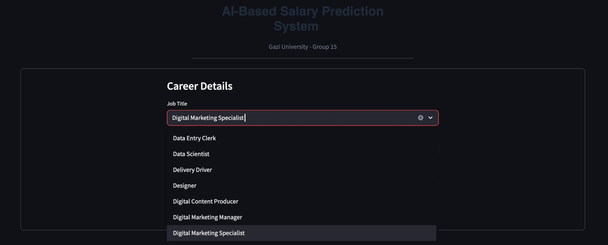
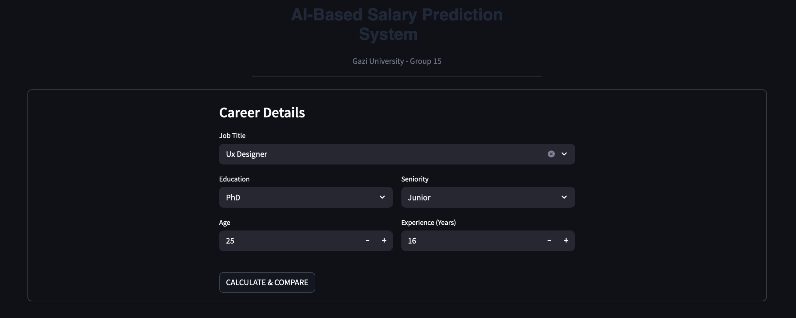
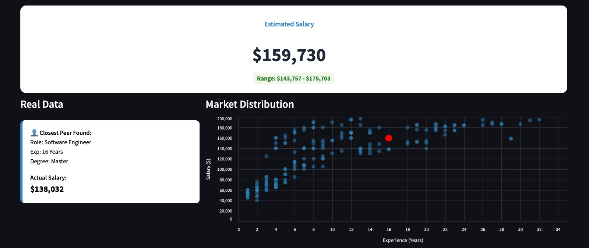

# AI-Based Salary Estimation and Recommendation System

  

---

<details>
<summary><h2>ENGLISH </h2></summary>

### Project Description
This project is an **Artificial Intelligence-supported web application** designed to estimate fair salary ranges for employees based on their professional profiles. By leveraging machine learning algorithms trained on extensive market data, the system analyzes key variables such as **Job Title, Education Level, Seniority, Age, and Years of Experience**.

Beyond simple prediction, the system offers a comparative analysis tool. It visualizes the user's position within the current market distribution and identifies the "Closest Peer" from the dataset to provide a realistic benchmark.

### Key Features
* **Dynamic Data Input:** User-friendly interface for entering detailed career metrics.
* **ML-Powered Prediction:** Instant salary estimation with a calculated confidence interval.
* **Market Analysis:** A scatter plot visualization showing where the user stands compared to industry peers.
* **Peer Comparison:** Identifies the most similar real-world profile for validation.

### Screenshots

**1. Job Selection & Data Entry**
*User selects the specific job title and enters career details.*




**2. Prediction Result & Market Analysis**
*The system calculates the estimated salary and visualizes the market position.*



### Installation & Usage
1.  **Clone the Repository:**
    ```bash
    git clone (https://github.com/ahmetemircoskun/SalaryRecommendationSystem.git)
    ```
2.  **Install Dependencies:**
    ```bash
    pip install -r requirements.txt
    ```
3.  **Run the App:**
    ```bash
    streamlit run main.py
    ```

</details>

---

<details>
<summary><h2>TÜRKÇE </h2></summary>

### Proje Açıklaması
Bu proje, çalışanların profesyonel profillerine dayanarak adil maaş aralıklarını tahmin etmek için tasarlanmış **Yapay Zeka destekli bir web uygulamasıdır**. Sistem, geniş piyasa verileri üzerinde eğitilmiş makine öğrenmesi algoritmalarını kullanarak **İş Ünvanı, Eğitim Seviyesi, Kıdem, Yaş ve Deneyim Yılı** gibi temel değişkenleri analiz eder.

Sistem sadece tahmin sunmakla kalmaz, aynı zamanda karşılaştırmalı bir analiz aracı olarak çalışır. Kullanıcının mevcut piyasa dağılımındaki konumunu görselleştirir ve veri setinden "En Yakın Eşleşen Profili" (Closest Peer) bularak gerçekçi bir referans noktası sunar.

### Temel Özellikler
* **Dinamik Veri Girişi:** Kariyer metriklerinin girildiği kullanıcı dostu arayüz.
* **ML Destekli Tahmin:** Hesaplanan güven aralığı ile anlık maaş tahmini.
* **Piyasa Analizi:** Kullanıcının sektördeki diğer kişilere göre konumunu gösteren saçılım grafiği.
* **Emsal Karşılaştırma:** Doğrulama için veri setinden en benzer gerçek dünya profilini tanımlama.

### Ekran Görüntüleri

**1. Meslek Seçimi ve Veri Girişi**
*Kullanıcı meslek ünvanını seçer ve kariyer detaylarını girer.*


**2. Tahmin Sonucu ve Piyasa Analizi**
*Sistem tahmini maaşı hesaplar ve piyasa konumunu görselleştirir.*


### Kurulum ve Kullanım
1.  **Repoyu Klonlayın:**
    ```bash
    git clone (https://github.com/ahmetemircoskun/SalaryRecommendationSystem.git)
    ```
2.  **Kütüphaneleri Yükleyin:**
    ```bash
    pip install -r requirements.txt
    ```
3.  **Uygulamayı Çalıştırın:**
    ```bash
    streamlit run main.py
    ```

</details>

---
### Group Members
<table>
  <thead>
    <tr>
      <th>Name</th>
      <th>Social</th>
    </tr>
  </thead>
  <tbody>
    <tr >
      <td>Ahmet Emir Coşkun</td>
      <td><a href="https://www.linkedin.com/in/ahmetemircoskun" target="_blank">
    
  </a></td>
    </tr>
    <tr>
      <td>Enes İnançlı</td>
      <td><a href="https://www.linkedin.com/in/enes-inançlı-9576a81a9/" target="_blank">
    
  </a></td>
    </tr>
    <tr>
      <td>Mustafa Temur Turan</td>
      <td><a href="https://www.linkedin.com/in/mustafa-temur-turan-b65656254/" target="_blank">
    
  </a></td>
    </tr>
  </tbody>
</table>
